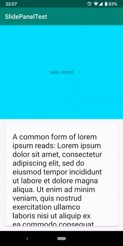
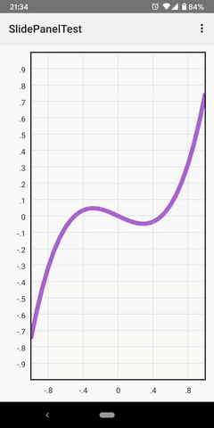
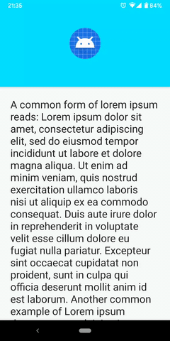
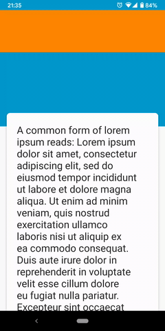

# SlidePanelTest

Sliding view container
trying ViewDragHelper, onTouchEvent + Animator, GestureDetector + Overscroller

GraphView sample (from googlesamples)
using GestureDetector, Overscroller, Zoomer, EdgeEffects

FitWindowFrameLayout
applyWindowInsets to FrameLayout and children

AppBarLayout (based on google material lib)
custom AppBarLayout + AppBarLayout.Behavior + AppBarLayout.ScrollingViewBehavior

Sliding view behaviour
custom SlidingViewBehaviour

Moution AppBar
integrate AppBarLayout behaviour using MotionLayout + SystemWindowInsets

   
  
  

   
  
  

